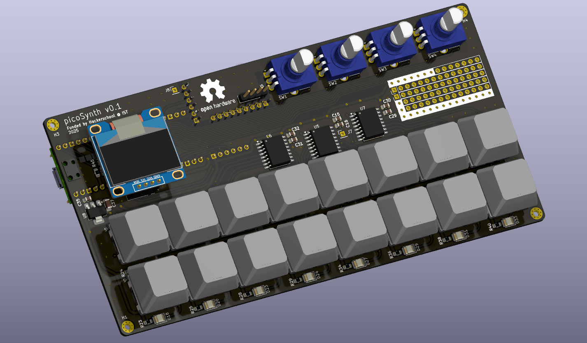

# Pico Synth Hardware

The Pico-Synth Board v0.1 is the first version of the synthesizer, featuring a DAC with line-out, a 4x4 switch matrix with individual LEDs, four rotary encoders with switches, an OLED screen, and an SD card slot for optional storage. This fist iteration of the board was designed with a focus on low cost and component availability.

